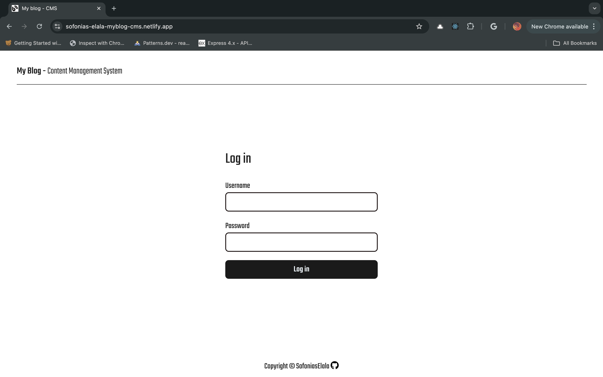
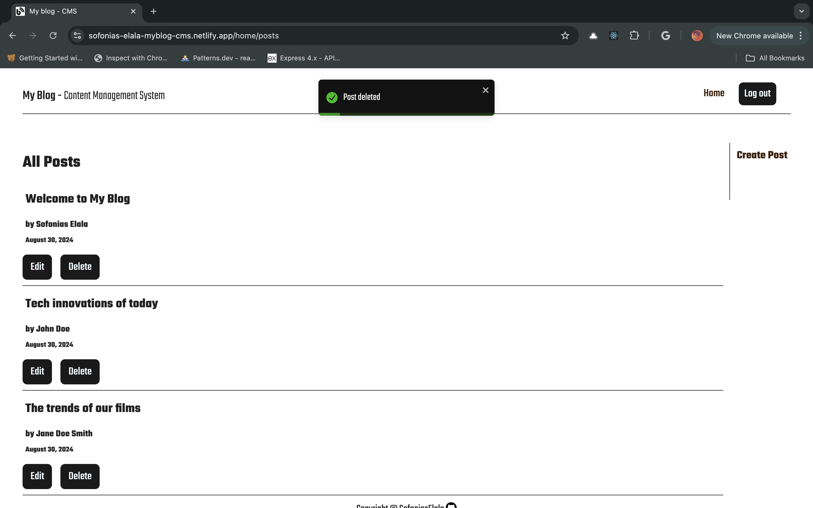
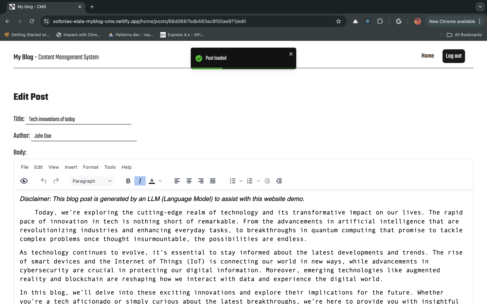
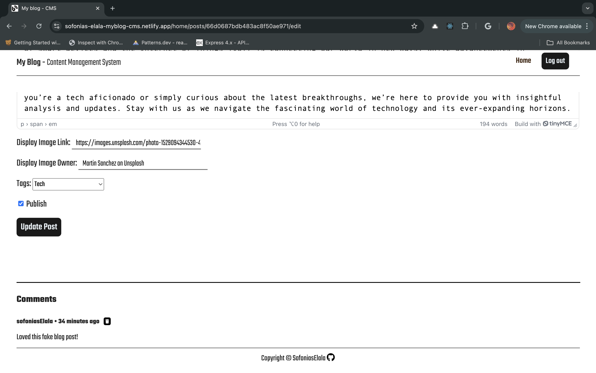
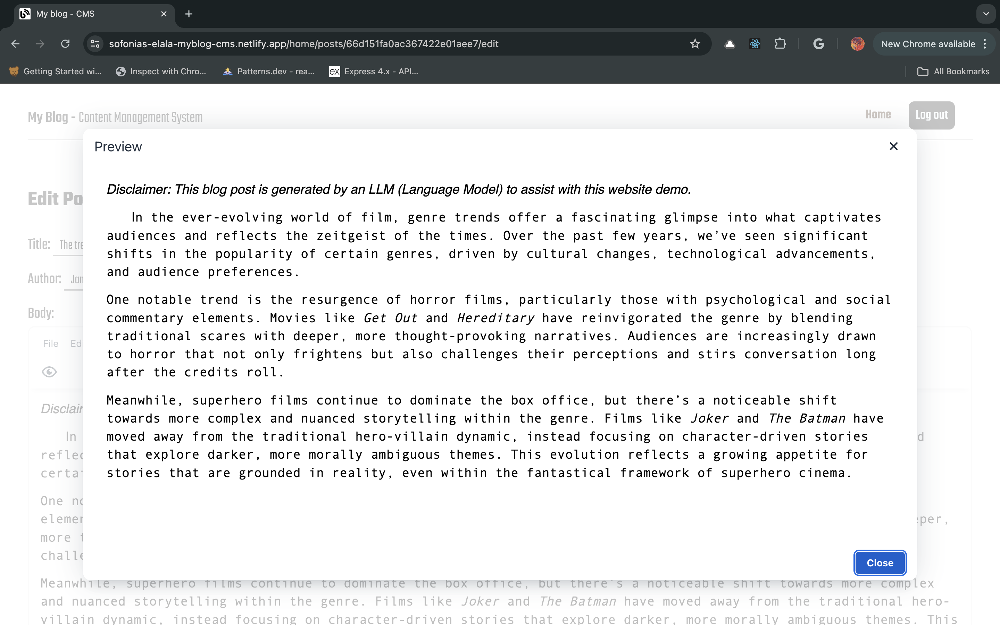

# My Blog - Content Management System

 

The login fields are pre-filled with a demo account for ease of access, as this project is for demonstration purposes only.

## Description
#### ***My Blog CMS*** is a content management system tailored for managing ***My Blog*** content. It enables the blogger to create, edit, and delete blog posts, as well as remove comments. This CMS includes a rich text editor with real-time preview, among other features. It also includes authentication to ensure secure access, as expected in any CMS.

## Links to the other ***My Blog*** repos
 * 
 * 

## Screenshots

## Technologies Used:
* REACT + Vite
* HTML5
* CSS3
* version control with Git/GitHub
* Hosting on Netlify

## Dependencies
* REACT + Vite
* React router for client side routing
* TinyMCE for the rich text editor
* Toastify for the toast notifications
* eslint